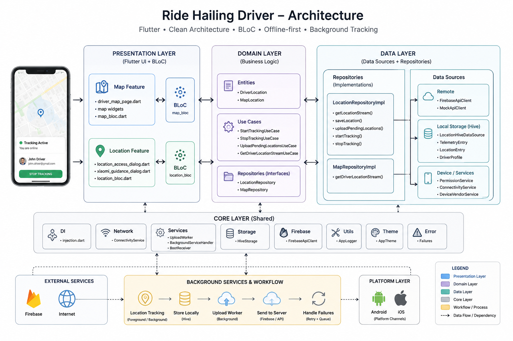

# Ride-Hailing Driver Tracking App

A production-grade Flutter driver application built for real-world ride-hailing operations. Features continuous background GPS tracking, offline-first data persistence, real-time map rendering, and zero data loss architecture.

---

## What This App Does

When a driver accepts a trip, the app continuously tracks their GPS position — even when the app is in the background, the screen is locked, or the device loses network connectivity. Every location fix is saved locally first, then uploaded to the backend in batches. The map screen shows the driver's position with smooth marker animation.

The app is designed to handle real-world conditions that commonly affect tracking reliability: long-running trips, temporary network loss, application restarts, device reboots, and aggressive OEM battery management policies (particularly Xiaomi/MIUI devices).

## Demo

Screen recording of live GPS tracking, background updates, and map animation:

[screen_recording.mov](docs/screen_recording.mov)

---

## Key Features

- **Background GPS tracking** via Android foreground service / iOS background mode — continues tracking when the app is in the background, the screen is locked, or the task is removed from Recent Apps (subject to platform restrictions)
- **Offline-first Hive queue** — every GPS fix is persisted before any network call; no data loss on network failure
- **Automatic upload** with exponential backoff and dead-letter pause — queue drains automatically when connectivity returns
- **Real-time Google Maps** with smooth marker interpolation between GPS fixes
- **Trip restoration** on app restart or reboot — no manual "Start Trip" required after a crash
- **Country-specific configuration** — GPS intervals, accuracy thresholds, payment providers, and map providers vary by market
- **Firebase Firestore backend** with a full drop-in mock for development and testing
- **Telemetry event log** persisted in Hive for post-incident diagnosis
- **Xiaomi / MIUI battery optimization guidance** — detects the device and walks the driver through whitelisting
- **Permission handling** for foreground location, background location, and notifications
- **BLoC state management** with droppable event transformer (prevents duplicate trip starts)

---

## Architecture

### System Overview



### Clean Architecture + Feature-Based Modules

The project is organized by feature, not by layer. Each feature (`location`, `map`) contains its own `data/`, `domain/`, and `presentation/` sub-trees:

```
lib/
├── core/                          # Cross-cutting concerns
│   ├── config/                    # CountryConfig, backend selection
│   ├── di/                        # GetIt dependency injection
│   ├── mock_api/                  # MockApiClient + ApiClient interface
│   ├── network/                   # ConnectivityService
│   ├── services/                  # BackgroundServiceHandler, UploadWorker
│   ├── storage/                   # HiveStorage, TypeAdapters
│   ├── theme/                     # AppTheme
│   └── utils/                     # AppLogger
├── features/
│   ├── location/                  # Background tracking, offline queue, upload
│   │   ├── data/
│   │   │   ├── datasources/
│   │   │   │   ├── location_local_datasource.dart
│   │   │   │   └── location_remote_datasource.dart
│   │   │   ├── models/
│   │   │   │   └── driver_location_model.dart
│   │   │   └── repositories/
│   │   │       └── location_repository_impl.dart
│   │   ├── domain/
│   │   │   ├── entities/
│   │   │   │   └── driver_location.dart
│   │   │   ├── repositories/
│   │   │   │   └── location_repository.dart
│   │   │   └── usecases/
│   │   │       ├── start_tracking_usecase.dart
│   │   │       ├── stop_tracking_usecase.dart
│   │   │       └── upload_pending_locations_usecase.dart
│   │   └── presentation/
│   │       ├── bloc/
│   │       │   ├── location_bloc.dart
│   │       │   └── location_state.dart
│   │       └── widgets/
│   │           ├── location_access_dialog.dart
│   │           └── xiaomi_guidance_dialog.dart
│   └── map/                       # Real-time driver position display
│       ├── data/
│       │   ├── datasources/
│       │   │   └── map_location_datasource.dart
│       │   └── repositories/
│       │       └── map_repository_impl.dart
│       ├── domain/
│       │   ├── entities/
│       │   │   └── map_location.dart
│       │   ├── repositories/
│       │   │   └── map_repository.dart
│       │   └── usecases/
│       │       └── get_driver_location_stream_usecase.dart
│       └── presentation/
│           ├── bloc/
│           │   └── map_bloc.dart
│           ├── pages/
│           │   └── driver_map_page.dart
│           └── widgets/
│               ├── driver_info_card.dart
│               ├── map_provider_widget.dart
│               └── tracking_status_panel.dart
├── firebase_options.dart
├── app.dart
└── main.dart
```

**Domain layer** is pure Dart — no Flutter or framework dependencies. **Data layer** implements domain interfaces and knows about Hive, Firestore, and the API contract. **Presentation layer** knows only about domain entities and use cases.

### Why Hive Instead of SQLite/Drift

The app does not need relational queries or JOINs. All access patterns are keyed reads/writes or sequential queue scans. Hive handles this without schema migrations or native binaries. `LazyBox` loads entries from disk on demand — a 5,000-entry backlog does not load 5,000 objects into memory simultaneously.

### Background Isolate Owns the Full Pipeline

The most important architectural decision in this solution is that the complete tracking pipeline runs inside the background Dart isolate rather than relying on the main Flutter isolate.

```text
GPS Fix
   ↓
Hive Persistence
   ↓
Batch Upload
   ↓
Server ACK
   ↓
Delete Confirmed Records

---

## Offline-First Strategy

Every GPS fix follows this pipeline:

1. Background service receives a position from `Geolocator.getPositionStream`.
2. The fix is written to the Hive `location_queue` LazyBox using its UUID as the key. This is the point of no return — the data survives process death from here.
3. An upload attempt is made immediately in the background isolate.
4. If the upload succeeds, the server-ACK'd UUIDs are deleted from the box.
5. If the upload fails (network unavailable, server 5xx), the entry remains in the box with an incremented `retryCount`.
6. `UploadWorker` in the main isolate runs on an independent timer and drains the queue whenever connectivity is available. It uses exponential backoff (doubling from the base interval, capped at 12×) and pauses for a 5-minute cooldown after 5 consecutive failures.
7. On connectivity restoration, `ConnectivityService` emits an event. `LocationBloc` logs the recovery; the `UploadWorker` timer picks it up on the next tick.

Entries never leave the queue until the server ACKs them. There is no `isUploaded` flag — that pattern is a common source of data-loss bugs.

---

## Setup

### Prerequisites

- Flutter SDK 3.x
- Android Studio or Xcode
- A Google Maps API key
- Optional: Firebase project (only when using `BackendType.firebase`)

### 1. Install dependencies

```bash
flutter pub get
```

### 2. Google Maps API key

**Android** — add to `android/app/src/main/AndroidManifest.xml`:

```xml
<meta-data
    android:name="com.google.android.geo.API_KEY"
    android:value="YOUR_KEY"/>
```

**iOS** — add to `ios/Runner/AppDelegate.swift`:

```swift
GMSServices.provideAPIKey("YOUR_KEY")
```

### 3. Select backend

In `lib/core/config/backend_config.dart`:

```dart
const BackendType activeBackend = BackendType.mock;   // no Firebase needed
// or
const BackendType activeBackend = BackendType.firebase; // requires setup below
```

### 4. Firebase setup (if using Firebase backend)

1. Create a project at [console.firebase.google.com](https://console.firebase.google.com).
2. Enable Cloud Firestore in Native mode.
3. Register Android app (`com.ridehailing.driver`) → download `google-services.json` to `android/app/`.
4. Register iOS app (`com.ridehailing.driver`) → download `GoogleService-Info.plist` to `ios/Runner/`.
5. Regenerate `lib/firebase_options.dart`:

```bash
dart pub global activate flutterfire_cli
flutterfire configure
```

### 5. Run

```bash
flutter run                   # physical device recommended for background service
flutter run --release         # tests kill/restore behaviour
```

---

## Running Tests

```bash
flutter test test/unit/
flutter test --reporter expanded test/unit/location_bloc_test.dart
```

| Test File | What It Tests |
|---|---|
| `location_queue_test.dart` | Hive queue save, retrieve, delete, count, recovery, cleanup |
| `location_bloc_test.dart` | BLoC events → state transitions, error handling, pending count |
| `map_bloc_test.dart` | Map init, location updates, route accumulation, interpolation |
| `mock_api_test.dart` | ApiClient contract, retry semantics, error classification |
| `connectivity_recovery_test.dart` | Queue drain after offline period |
| `gps_accuracy_filter_test.dart` | Accuracy gate behaviour |
| `restoration_test.dart` | Trip recovery after process kill |
| `upload_worker_test.dart` | Exponential backoff, dead-letter pause |
| `location_repository_integration_test.dart` | End-to-end repository flow |

---

## Key Design Decisions

### Why the Background Isolate Owns Persistence

Most Flutter location-tracking tutorials send GPS events across a platform channel to the main isolate, which then writes to storage. This breaks when the user swipes the app away — the main isolate dies, and nothing is saved. By running the full pipeline (GPS → Hive → upload → delete-on-ACK) inside the background isolate, the app survives the main isolate being killed.

### Why Delete-on-ACK Instead of Mark-Uploaded

A common pattern is to set an `isUploaded=true` flag on each record after upload. If the app crashes between the upload and the flag update, the record is permanently orphaned. By deleting only after the server ACKs, there is no intermediate state that can be lost.

### Why a Mock API Client

The challenge does not provide a backend URL, contract, or auth mechanism. Building against invented URLs would couple the business logic to assumptions. `MockApiClient` implements the `ApiClient` interface, simulating realistic latency (120–600ms) and a 15% random failure rate. All retry logic, error handling, and ACK parsing operate identically to a real HTTP client. Swapping to a real backend requires changing one line in `injection.dart`.

### Why `droppable()` on Start Events

If the user taps "Start Trip" twice (e.g., while a permission dialog is showing), a second start event is silently dropped while one is already in progress. This prevents duplicate trips without adding fragile debounce logic in the UI layer.

---

## Assumptions & Trade-offs

**Assumptions**
- The server accepts location batches as arrays of JSON objects and responds with a list of ACK'd UUIDs.
- Background location permission ("Always") is mandatory; foreground-only fallback is not supported.
- Driver identity is a locally generated UUID persisted in Hive — no authentication flow is in scope.
- Country configuration defaults are bundled in code; production would fetch from a config CDN.

**Trade-offs**
- **Hive over SQLite/Drift:** Sufficient for keyed queue access patterns and avoids native binaries. Lacks JOIN support and requires manual TypeAdapters.
- **Full pipeline in background isolate:** Persistence survives main-isolate death. Cost: both isolates independently initialise Hive and Firebase.
- **Hand-written TypeAdapters:** Avoids `build_runner` in CI. Requires careful field-count bookkeeping when adding fields.
- **Route render decimation at 1000 points:** Keeps Polyline rendering fast on long trips. Introduces minor visual inaccuracy in older route segments.